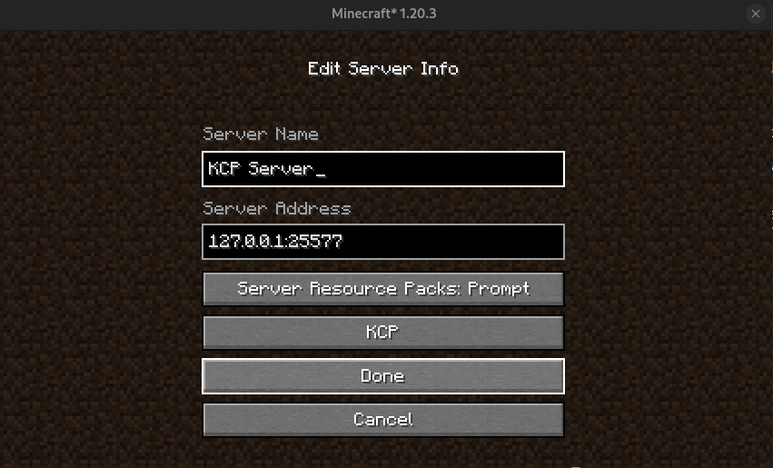

This mod downloads, runs & wraps [kcptun](https://github.com/xtaci/kcptun).

## Server

The mod will run on launch

On first launch a `kcp.conf` will get created on `config/kcp.conf` with this data.

```config
enabled=true
port=25577
```

Set enabled to true and configure whatever **UDP** port you want to use as KCP receiver.

---

## Client

On multiplayer add/edit server you will see an extra button that works as a toggle.
You can switch between TCP(minecraft default) and KCP



Specify kcp server host & port

> [!WARNING]
> Server ping is not done yet! so kcp servers wont ping nor load image/motd on multiplayer list.

---

Kcp auto configures on [no encryption & fast3](https://github.com/Kahzerx/kcp-mod/blob/1.20.x/src/main/java/com/kahzerx/kcp/config/KCPServerConfig.java#L24), further customization is on TODO...

Java runs the KCP service as a process, it could happen that a kcp process gets stuck orphan if minecraft dies(depends on how the os handles it). If that happens you can either reboot or manually kill the service, it runs on no persistence at all.

To prevent port collision client side since user cant select on which port kcp client service listener gets setup, a random port is selected on each multiplayer connection for it.
